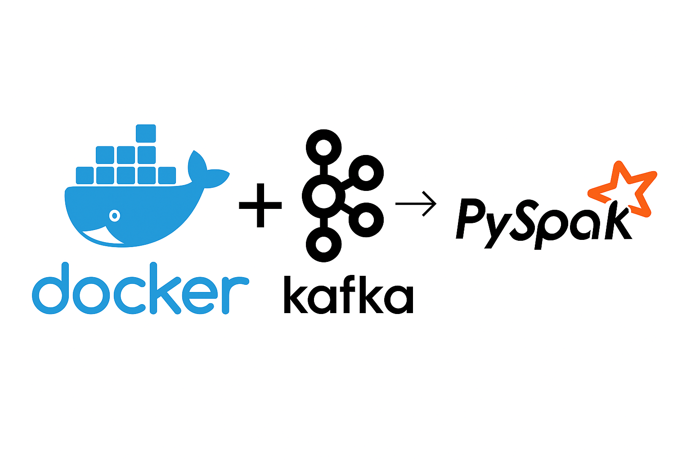

# PySpark_exercise
En este ejercicio trabajarás con **datos de sensores generados en streaming** y procesados con **PySpark**.  
El objetivo es que practiques desde la lectura de datos en tiempo real hasta análisis y agregaciones avanzadas, **dentro de un entorno Dockerizado con Jupyter y PySpark**.

### 🔹 Flujo general de los datos:

1. **Entorno Docker**  
   - Se levanta un contenedor con **Jupyter Notebook + PySpark**.  
   - También se levantan contenedores para **Kafka** y **Zookeeper**, simulando un entorno de producción real.  
   - Se accede al notebook mediante la URL que Spark imprime al iniciar Jupyter (sin necesidad de contraseña).

2. **Lectura desde Kafka**  
   Los datos de los sensores llegan continuamente a un topic de Kafka. Cada mensaje contiene información como: `sensor_id`, `value`, `temperature`, `humidity`, `status`, `timestamp` y `uuid`.

3. **Parseo y transformación**  
   Los mensajes JSON se transforman en columnas individuales, y se crea una columna `event_time` que convierte el timestamp a formato de fecha/hora. Esto permite trabajar con ventanas temporales y agregaciones.

4. **Agregaciones por ventana**  
   Los datos se agrupan en **ventanas de tiempo de 30 segundos** por cada sensor, calculando métricas como:
   - Promedio del valor (`avg_value`)  
   - Promedio de la temperatura (`avg_temp`)  
   - Promedio de la humedad (`avg_humidity`)  
   - Número de eventos (`num_events`)  
   Además, se utiliza un **watermark de 1 minuto** para manejar retrasos y datos tardíos.

5. **Escritura en archivos Parquet**  
   Los resultados agregados se escriben continuamente en archivos Parquet en la carpeta `resultados/`.  
   Se usa un **checkpoint** para asegurar que Spark recuerde qué datos ya se procesaron, evitando duplicados si el streaming se reinicia.

### 🔹 Qué vas a practicar en este ejercicio:

- Levantar un entorno **Dockerizado** con Jupyter, PySpark y Kafka  
- Lectura de datos en **streaming** desde Kafka  
- Transformación y parseo de mensajes JSON  
- Creación y uso de **ventanas de tiempo**  
- Agregaciones y estadísticas sobre los datos de sensores  
- Escritura continua de resultados en **Parquet**  
- Exploración y análisis de los resultados agregados  

Al final del ejercicio, tendrás un conjunto de datos consolidados que podrás **consultar y analizar** para responder preguntas sobre comportamiento de los sensores, detección de anomalías, ranking, y más.

# PASOS A SEGUIR IMPORTANTE

1. En una terminal levantar el docker con el siguiente comando
   - docker-compose up --build
2. Haceros un split de la terminal y ejecutar el productor de mensajes de kafka desde dentro
del contenedor
   - docker exec -it pyspark_lab bash
   - python kafka-producer/producer.py
3. Abrir una nueva terminal y ejecutar el comando para obtener la URL que podeis usar
   - docker-compose logs -f jupyter

Teneis todos estos comando en el archivo comandos.txt para que lo veais mas fácil, cualquier duda para levantar el entorno no dudeis en comunicarmela sin ningún problema. 

# 📘 Ejercicio – PySpark & Streaming
Procesamiento y análisis de datos agregados por ventana.

Este ejercicio está diseñado para evaluar tu dominio de PySpark aplicado a procesamiento de datos reales provenientes de un flujo de streaming. Trabajarás con el DataFrame final generado tras las agregaciones, el cual contiene:

- `window` – Ventana temporal (start, end)
- `sensor_id` – Identificador del sensor
- `avg_value` – Valor promedio de la métrica principal
- `avg_temp` – Temperatura promedio
- `avg_humidity` – Humedad promedio
- `num_events` – Número de eventos agregados

---

## 🧰 0. Preparación
Asegúrate de:

- Haber cargado correctamente el DataFrame producido por el streaming.
- Eliminar cualquier columna creada manualmente o que no forme parte del esquema original.

---

## 🔍 1. Exploración inicial
Realiza una exploración básica del DataFrame:

- Muestra el esquema completo.
- Indica cuántas filas contiene.
- ¿Cuántos sensores distintos (`sensor_id`) aparecen?

---

## 🔧 2. Transformaciones numéricas
Crea una columna basada en la diferencia o relación entre dos métricas numéricas del DataFrame.

Responde:

- ¿Cuál es el valor mínimo, máximo y medio de la nueva columna?

---

## 🧹 3. Filtrado avanzado
Aplica un filtro usando varias condiciones a la vez relacionadas con:

- humedad,
- número de eventos,
- sensor.

Responde:

- ¿Cuántos registros cumplen todas las condiciones aplicadas?

---

## 📊 4. Agregaciones por sensor
Agrupa el DataFrame por `sensor_id` y obtén estadísticas descriptivas.

Responde:

- ¿Qué sensor tiene la mayor media en la variable analizada?
- ¿Qué sensor presenta la temperatura máxima?
- ¿Cuántos grupos o ventanas existen por sensor?

---

## 🏅 5. Ranking con funciones de ventana
Usa funciones de ventana para identificar, para cada sensor, el registro con el mayor valor de `avg_value`.

Responde:

- ¿Qué sensor obtiene el valor máximo global entre todos?

---

## 🔗 6. Join con tabla auxiliar
Crea un DataFrame auxiliar con información adicional sobre sensores (por ejemplo, categoría, ubicación o tipo) y realiza un join.

Responde:

- Muestra los cinco primeros registros del DataFrame ya unido.

---

## 🕒 7. Agrupación por ventana temporal
Extrae la marca de inicio de la ventana y agrúpala por unidades de tiempo truncadas (p. ej., minuto u hora).

Responde:

- ¿Cuántas ventanas hay por unidad temporal?
- ¿Cuál es la humedad media por cada unidad?

---

## 🧩 8. Repartición y particiones
Reparte el DataFrame por `sensor_id` y añade una columna indicando el identificador de partición.

Responde:

- ¿Cuál es la distribución de registros entre las particiciones?

---

## 🚨 9. Detección de anomalías
Define un criterio personalizado de "anomalía" basado en los valores medios del DataFrame.

Responde:

- ¿Cuántos registros son anómalos?
- ¿Qué sensor tiene más anomalías?

---

## 🔢 10. Cruce de métricas
Crea una puntuación combinando varias columnas del DataFrame (por ejemplo, ponderando `avg_value`, temperatura y humedad).

Responde:

- ¿Qué sensor obtiene la puntuación más alta?
- ¿Cuál es el valor de dicha puntuación?

---

## 🔢 11. Graficar DF
Crea dos gráficos, convirtiendo el DF de spark a pandas y utiliza la libreria matplotlib 
para generar dos gráficos sobre alguna de las variables.

